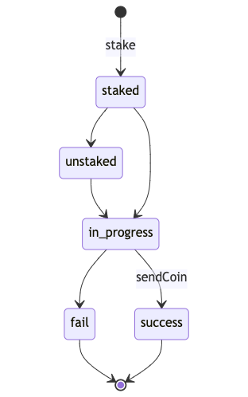
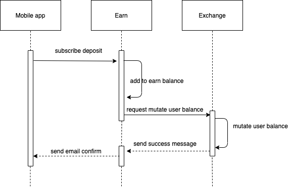
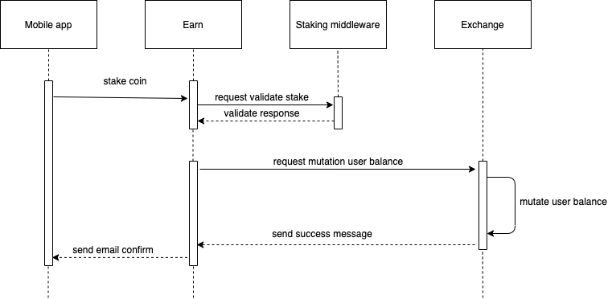

# tokenomy
Tokenomy modelling
## Architecture

## State machine diagram
### Fixed deposit

## Stake and unstake

## Entity relationship

## Sequence diagram
### Fixed deposit

### Stake

### Unstake

## Activity diagram
### Fixed deposit

### Stake

### Unstake

